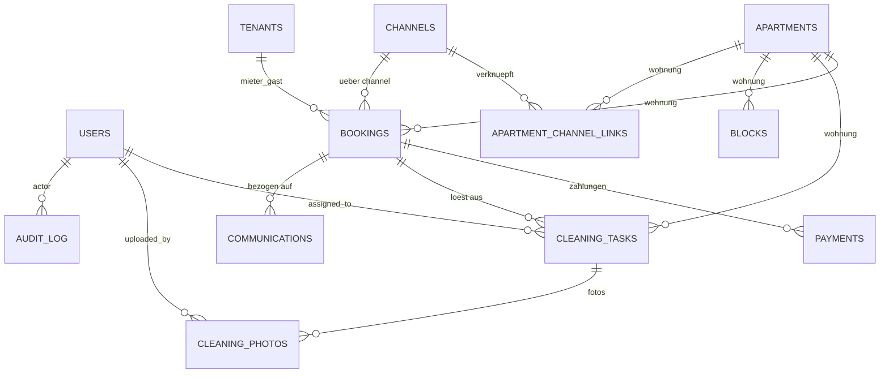

# Datenmodell

Dieses Modell ist auf Postgres + Supabase ausgelegt. Alle Tabellen haben:

- `id uuid primary key default gen_random_uuid()`
- `created_at timestamptz default now()`
- `updated_at timestamptz default now()` (Trigger setzt `now()` bei UPDATE)

Geld wird als `numeric(12,2)` gespeichert. Aufzählungen sind echte
Postgres-`enum`-Typen (siehe Abschnitt „Enums" unten).

## ER-Diagramm



## Tabellen

### `users`

Erweitert `auth.users` aus Supabase um App-spezifische Felder.

| Feld | Typ | Notiz |
|------|-----|-------|
| `id` | uuid PK = `auth.users.id` | |
| `email` | text unique | |
| `full_name` | text | |
| `role` | enum `user_role` | `admin`, `office`, `cleaning`, `management` |
| `phone` | text | |
| `is_active` | boolean default true | |

### `apartments`

| Feld | Typ | Notiz |
|------|-----|-------|
| `number` | text unique | sichtbare Wohnungsnummer |
| `type` | enum `apartment_type` | `junior`, `senior`, später erweiterbar |
| `size_sqm` | numeric(6,2) | Quadratmeter |
| `floor` | int | |
| `status` | enum `apartment_status` | `available`, `occupied`, `blocked`, `maintenance` (abgeleitet, persistiert für Performance) |
| `allowed_rental_types` | enum `rental_type`[] | Array, z. B. `{long_term,short_term,booking}` |
| `standard_rent` | numeric(12,2) | monatliche Standardmiete |
| `short_term_flat_rate` | numeric(12,2) | Kurzzeitpauschale |
| `has_parking` | boolean default false | |
| `parking_fee` | numeric(12,2) null | wenn `has_parking` |
| `booking_priority` | int default 0 | höher = wird zuerst zugewiesen |
| `cleaning_buffer_hours` | int default 6 | |
| `notes` | text | |

Index: `gin (allowed_rental_types)`, `btree (status)`.

### `tenants`

Mieter und Gäste in einer Tabelle, unterschieden über `tenant_kind`.

| Feld | Typ | Notiz |
|------|-----|-------|
| `tenant_kind` | enum | `tenant` (Langzeit/Kurzzeit) oder `guest` (Booking & Co.) |
| `first_name`, `last_name` | text | |
| `email` | text | nullable bei Gästen ohne Mailadresse |
| `phone` | text | |
| `address` | text | |
| `nationality` | text | ISO-Code |
| `date_of_birth` | date | |
| `id_document_type` | enum `id_doc_type` | `passport`, `id_card`, `driver_license` |
| `id_document_number` | text | |
| `source` | enum `tenant_source` | `direct`, `flatfox`, `booking_com`, `airbnb`, `expedia`, `website` |
| `notes` | text | |

### `channels`

| Feld | Typ | Notiz |
|------|-----|-------|
| `code` | text unique | `booking_com`, `airbnb`, `expedia`, `direct`, `flatfox`, `immotop` |
| `display_name` | text | |
| `is_active` | boolean | |
| `config` | jsonb | API-Keys, iCal-URLs, Webhook-Secrets (verschlüsselt) |

### `apartment_channel_links`

Verbindet Wohnungen mit Channels und hält die externe ID.

| Feld | Typ | Notiz |
|------|-----|-------|
| `apartment_id` | uuid FK | |
| `channel_id` | uuid FK | |
| `external_id` | text | z. B. Booking room_id |
| `ical_pull_url` | text | iCal-Import-URL |
| `ical_push_url` | text | unsere Export-URL |

PK: `(apartment_id, channel_id)`.

### `bookings`

Zentrale Tabelle für Mietverhältnisse aller drei Arten.

| Feld | Typ | Notiz |
|------|-----|-------|
| `apartment_id` | uuid FK | |
| `tenant_id` | uuid FK | |
| `rental_type` | enum `rental_type` | `long_term`, `short_term`, `booking` |
| `channel_id` | uuid FK null | nur bei `booking`/`direct` etc. |
| `external_reference` | text | Booking-Nr., Immotop-Vertragsnr. |
| `start_date` | date | Einzug |
| `end_date` | date | Auszug (exklusive) |
| `check_in_time` | time null | |
| `check_out_time` | time null | |
| `rent_amount` | numeric(12,2) | bei Booking = Gesamt­betrag |
| `deposit_amount` | numeric(12,2) | |
| `short_term_flat_rate` | numeric(12,2) null | |
| `parking_included` | boolean default false | |
| `parking_fee` | numeric(12,2) null | |
| `contract_status` | enum | `draft`, `sent`, `signed`, `cancelled` |
| `payment_status` | enum | `pending`, `partial`, `paid`, `overdue` (abgeleitet aus `payments`) |
| `check_in_status` | enum | `pending`, `completed` |
| `check_out_status` | enum | `pending`, `completed` |
| `status` | enum `booking_status` | `planned`, `active`, `completed`, `cancelled` |
| `notes` | text | |

**Constraint Doppelbelegung**:

```sql
ALTER TABLE bookings
  ADD CONSTRAINT bookings_no_overlap
  EXCLUDE USING gist (
    apartment_id WITH =,
    daterange(start_date, end_date, '[)') WITH &&
  ) WHERE (status IN ('planned','active'));
```

### `blocks`

Für Wartung, Eigennutzung, Sperrungen.

| Feld | Typ | Notiz |
|------|-----|-------|
| `apartment_id` | uuid FK | |
| `start_date`, `end_date` | date | |
| `reason` | text | |
| `created_by` | uuid FK users | |

Gleicher Exclude-Constraint wie `bookings` (aber separat).

### `payments`

| Feld | Typ | Notiz |
|------|-----|-------|
| `booking_id` | uuid FK | |
| `type` | enum `payment_type` | `rent`, `deposit`, `first_rent`, `booking_payout`, `short_term_flat`, `parking`, `other` |
| `amount` | numeric(12,2) | |
| `due_date` | date | |
| `paid_date` | date null | |
| `status` | enum `payment_status` | `pending`, `paid`, `overdue`, `cancelled` |
| `method` | enum `payment_method` | `bank_transfer`, `manual_slip`, `booking_payout`, `flatfox`, `card`, `other` |
| `reference` | text | Belegnummer |
| `notes` | text | |

Funktion `recompute_booking_payment_status(booking_id)` läuft per Trigger nach
INSERT/UPDATE/DELETE in `payments` und setzt `bookings.payment_status`.

### `cleaning_tasks`

| Feld | Typ | Notiz |
|------|-----|-------|
| `apartment_id` | uuid FK | |
| `booking_id` | uuid FK null | auslösende Buchung |
| `scheduled_date` | date | |
| `scheduled_window` | tstzrange null | optional Zeitfenster |
| `type` | enum `cleaning_type` | `checkout`, `pre_checkin`, `intermediate`, `special`, `deep_clean` |
| `priority` | enum | `low`, `normal`, `high`, `urgent` |
| `status` | enum `cleaning_status` | `open`, `in_progress`, `done`, `quality_checked` |
| `assigned_to` | uuid FK users null | |
| `notes` | text | |
| `completed_at` | timestamptz null | |
| `quality_checked_at` | timestamptz null | |
| `quality_checked_by` | uuid FK users null | |

### `cleaning_photos`

| Feld | Typ | Notiz |
|------|-----|-------|
| `cleaning_task_id` | uuid FK | |
| `storage_path` | text | Pfad in Bucket `cleaning-photos` |
| `uploaded_by` | uuid FK users | |
| `taken_at` | timestamptz null | EXIF wenn vorhanden |

### `communications`

| Feld | Typ | Notiz |
|------|-----|-------|
| `booking_id` | uuid FK null | |
| `apartment_id` | uuid FK null | |
| `type` | enum `communication_type` | `welcome`, `payment_info`, `checkin_info`, `wifi_info`, `payment_reminder`, `checkout_info`, `internal_cleaning_notification` |
| `channel` | enum | `email`, `sms`, `internal` |
| `recipient` | text | |
| `subject` | text | |
| `body` | text | |
| `status` | enum | `draft`, `scheduled`, `sent`, `failed`, `cancelled` |
| `scheduled_at` | timestamptz null | |
| `sent_at` | timestamptz null | |
| `template_key` | text | für Wiederverwendung |

### `audit_log`

| Feld | Typ | Notiz |
|------|-----|-------|
| `actor_id` | uuid FK users null | |
| `entity_type` | text | `apartments`, `bookings`, ... |
| `entity_id` | uuid | |
| `action` | text | `create`, `update`, `delete`, `status_change` |
| `diff` | jsonb | alte ↔ neue Werte |
| `created_at` | timestamptz | |

## Enums

```sql
create type user_role        as enum ('admin','office','cleaning','management');
create type apartment_type   as enum ('junior','senior','suite','studio');
create type apartment_status as enum ('available','occupied','blocked','maintenance');
create type rental_type      as enum ('long_term','short_term','booking');
create type booking_status   as enum ('planned','active','completed','cancelled');
create type payment_type     as enum ('rent','deposit','first_rent','booking_payout','short_term_flat','parking','other');
create type payment_status   as enum ('pending','paid','overdue','cancelled');
create type payment_method   as enum ('bank_transfer','manual_slip','booking_payout','flatfox','card','other');
create type cleaning_type    as enum ('checkout','pre_checkin','intermediate','special','deep_clean');
create type cleaning_status  as enum ('open','in_progress','done','quality_checked');
create type communication_type as enum (
  'welcome','payment_info','checkin_info','wifi_info',
  'payment_reminder','checkout_info','internal_cleaning_notification'
);
create type tenant_kind      as enum ('tenant','guest');
create type tenant_source    as enum ('direct','flatfox','booking_com','airbnb','expedia','website');
create type id_doc_type      as enum ('passport','id_card','driver_license');
```

## Abgeleitete Sichten

- `view_apartment_status_today` – aktueller `apartment_status` aus `bookings`/`blocks`.
- `view_dashboard_kpis` – freie Wohnungen, kommende Ein-/Auszüge,
  offene Reinigungen, offene Zahlungen.
- `view_occupancy_calendar` – flache Sicht für die Kalender-UI.

Diese Views sind die einzige Schnittstelle, die das Dashboard liest.
